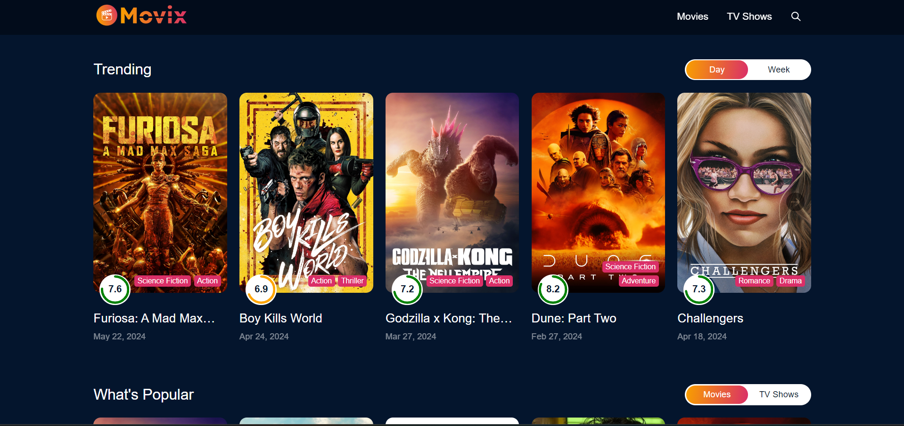

 

  
  
  
  
 
  

   
   

  <h2 align="center">MOVE-APP Website</h2>

  MOVE-APP is a fully responsive restaurant website,  Responsive for all devices, build using React,  SCSS, and vite.

  <a href="https://moveapp20.netlify.app/"><strong>➥ Live Demo</strong></a>

 

### Demo Screeshots

### Prerequisites

Before you begin, ensure you have met the following requirements:

* [Git](https://git-scm.com/downloads "Download Git") must be installed on your operating system.
 
### Contact

If you want to contact with me you can reach me at [instagram](https://www.instagram.com/aayush.ajs).

 
